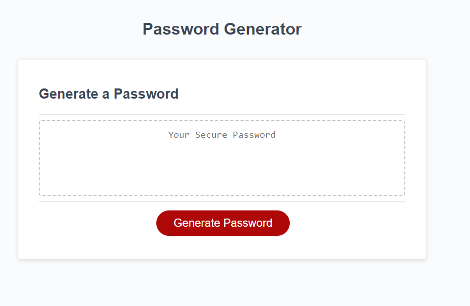

# JavaScript-Password-Generator
## An application that allows employees to generate a random password based on criteria that they've selected.

- My motivation for this project was to gain a deeper understanding of how JavaScript works.
- I built this project to practice my JavaScript language.
- This challenge will help me better understand how JavaScript is a critical component of building an application.
- I learned that JavaScript is important and the foudnational skills learned during the challenge will help me succeed with more intricate and complicated designs. 

## Screenshot
image: 